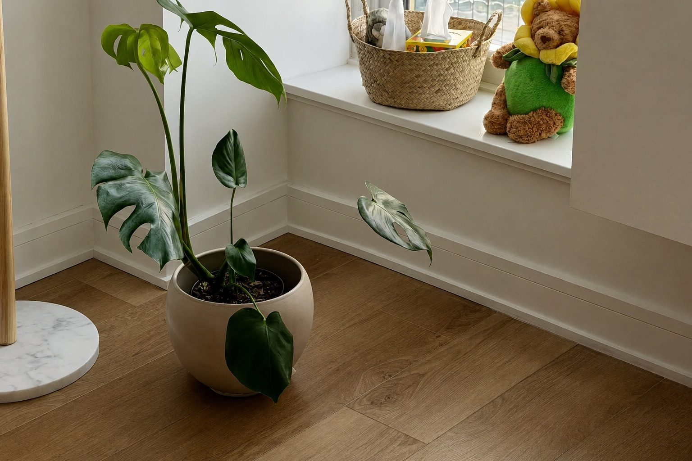

# 🤖 Smart Plant Watering System

    

> 🌱 Inspired by one too many plants that didn't survive my busy schedule.

A hardware/software side project built with Raspberry Pi, C++, and Linux.

Starting with GPIO-controlled pump automation, this project will gradually evolve into a complete smart plant care platform featuring:

- 🌱 Soil moisture sensing
- 💧 Automated irrigation
- 🌐 REST API
- 📈 Time-lapse growth monitoring
- 📷 Computer vision for plant health detection

---

## 🚀 Development Roadmap

### ⏳ Stage 1 — GPIO + Pump Control
